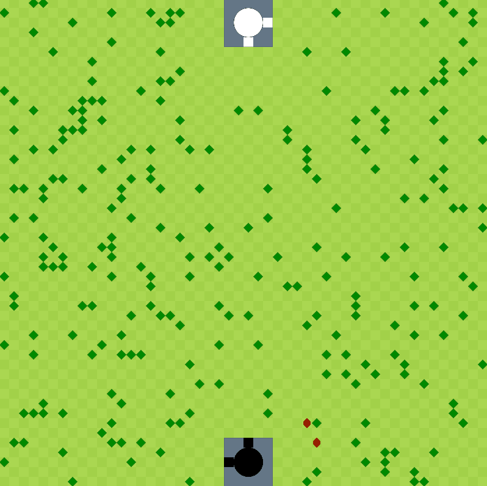
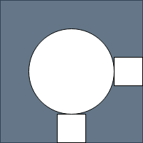

# HELBArmy - Java Project III - 2024-2025

> **El Bouchtili Imaddine | March 1st, 2025**

--------------------------

## Introduction
This project was developed using JavaFX technology for the Linux Ubuntu platform and was carried out as part of the Java III programming course. This course is part of the second-year Bachelor's degree in Computer Science : Application Development at the Haute École Libre de Bruxelles.

The project guidelines can be found here : [HELBArmy Statements.pdf](<ressources/HELBArmy Statements.pdf>) (FR).

The academic report of the project can be found here : [Java 3 Report - El Bouchtili Imaddine.docx](<Rapport JAVA 3 El Bouchtili Imaddine.docx>) (FR).

  

## Features
HELBArmy is a military battle simulation. Therefore, no player intervention is necessary for the simulation to function. However, keyboard keys can be pressed at any time to trigger actions.
The game consists of a board composed of three static elements (entities) and four dynamic elements (units that can move).

### Board
The board is a 2D grid where all entities are placed. Its size is freely adjustable, although some dimensions are more optimal for maintaining smooth and bug-free simulations. By default, entities occupy one tile on the board and have a unique (x, y) position.

### Entities
By default, entities cannot move on the board. They have a fixed position determined at the start of the program and do not change position until the simulation is reset.

#### City

Cities are the only entities that occupy more than one tile on the board. There are two cities, one in the North and one in the South. Each city has a size of 5x5 tiles and two gates. One gate is used for unit deployment, and the other serves as a wood deposit.

Wood is the only resource for cities. It acts as currency to determine which units will be generated. Unit generation is randomized based on the total wood available in the city.

#### Tree

Trees are the only entities that provide wood. They can be cut down to collect their wood. Once a tree's wood count reaches zero, it disappears for 30 seconds before reappearing in the same location with its initial wood quantity.

#### Collectable
To add action to the simulation, two types of collectables are present : the flag and the philosopher's stone. These items can be picked up by moving units.

- Flags appear every two minutes at a random position on the board. Once a flag appears, all units modify their behavior to move towards it. Capturing a flag grants a bonus to the unit's team.

- At the start of the game, two philosopher's stones appear on the board. Units are unaware of their locations. When a unit steps on one, it has a 50% chance of dying instantly or becoming invincible for the rest of the simulation.

### Units
Units are entities that can change position as the simulation progresses. Each unit has predefined statistics :
- Health Points
- Damage
- Damage Multiplier

Additionally, when a unit is adjacent to an enemy unit, combat begins until one of them dies.

#### Collector

Collectors aim to gather wood by cutting down trees for their cities. Once a collector's inventory is full, it returns to its city's wood deposit before heading to the next tree.

#### Deserter

Deserters focus on eliminating enemy collectors. However, they flee from all other unit types.

#### Horsemen

Horsemen have the most complex behavior. They act based on both enemies and allies.

When a horsemen is generated by a city, two scenarios are possible :
- If the horsemen is closer to an enemy deserter than to an allied horsemen, it will pursue the deserter.
- If an allied horsemen is closer, it will adjust its distance based on the established safety distance between horsemens of the same team.

The safety distance between horsemens of the same team increases by one tile per simulation tick. If a horsemen is engaged in combat, the safety distance for all horsemens in its team is immediately reduced to one. This mechanic creates visually appealing formations, such as the gradual expansion of Northern horsemens' safety distances.

#### Pikeman

When a pikeman appears, it is assigned a position to defend. Its goal is to move to this position and protect the surrounding area. If an enemy unit enters its field of vision, the pikeman will attack. A team's pikemen share a collective vision range equal to the number of pikemen in the team.

## Keyboard Shortcuts
To facilitate development and presentations, several keyboard shortcuts have been implemented, allowing actions such as :
- Generating specific units in a city
- Stopping unit movement
- Eliminating all units
- Spawning a collectable
- Restarting the simulation
